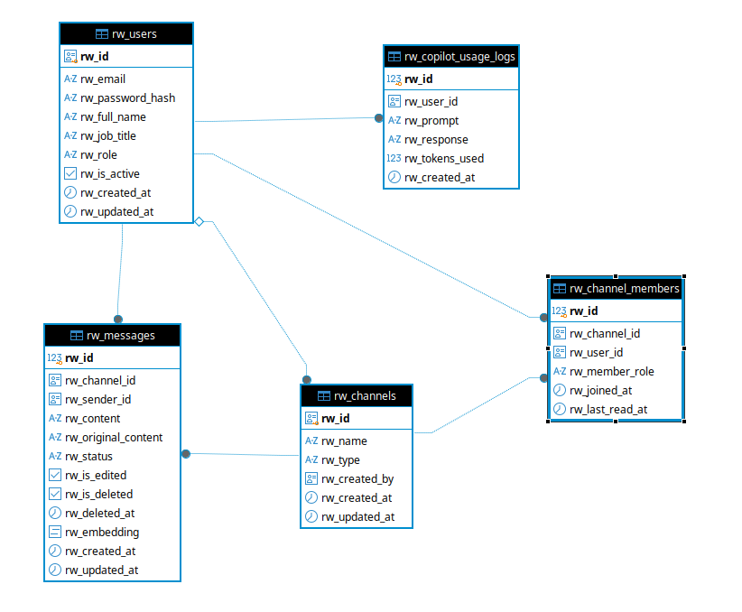

# Riwi Messaging Platform

## Project Overview
Riwi Messaging Platform is an enterprise internal communication platform developed for **Riwi Co. S.A.S.**. The platform delivers real-time messaging, secure user management, multi-channel communication (Public, Private, and Direct Messages), responsive user interfaces, and an AI Copilot powered by Retrieval-Augmented Generation (RAG) with strict database-level security enforcement (Row Level Security).

## Author
- **GitHub**: [antoniosanp](https://github.com/antoniosanp)

---

## Technical Stack

### Backend
- **Language & Runtime**: Java 21 (JDK 21)
- **Framework**: Spring Boot 3.2.x
- **Security**: Spring Security with Stateless JWT Authentication and BCrypt Password Hashing
- **Data Access**: Spring Data JPA & PostgreSQL Native Queries
- **Real-Time Engine**: STOMP WebSockets over SockJS (`/topic/channels/{channelId}`)
- **Database Migrations**: Flyway DB (`V1__create_initial_schema.sql`, `V2__security_and_rls.sql`, `V3__seed_data.sql`)
- **Documentation**: Swagger / OpenAPI 3 (`/swagger-ui.html`)

### Database
- **Engine**: PostgreSQL 16
- **AI Extensions**: `pgvector` with HNSW Cosine Similarity Index
- **Security Layer**: PostgreSQL Row Level Security (RLS) policies scoped by `app.current_user_id`
- **Integrity & Logic**: Primary Keys, Foreign Keys with explicit `ON DELETE` rules (`CASCADE`, `SET NULL`, `RESTRICT`), `CHECK` constraints, Triggers, Views, and Stored Procedures

### Frontend
- **Framework**: React 18 with TypeScript & Vite
- **Architecture**: Modular Layered Architecture (`types`, `services`, `i18n`, `components`, `pages`)
- **Internationalization (i18n)**: Native English and Spanish translation engine (`es.json`, `en.json`)
- **UI Design**: Riwi Co. S.A.S. design palette (Primary `#7E22CE`, Secondary `#06B6D4`, Surface `#F8FAFC`)
- **Layout**: Fixed 3-Zone Desktop layout (Channels Sidebar 280px, Chat Window Flex 1, Copilot Panel 360px) and Tabbed Mobile view

### AI Copilot & RAG
- **AI Engine**: Google AI Studio Gemini API (`gemini-3.6-flash`)
- **Resilience**: Automated multi-tier failover pipeline (`gemini-3.6-flash` -> `gemini-2.5-flash` -> `gemini-1.5-flash`)
- **Security**: Context retrieval restricted exclusively to channels authorized for the authenticated user via RLS
- **Features**: Source message citations, prompt versioning (`v1.1-RAG-IntelligentContext`), multilingual response adaptation, explicit permission refusal guardrails, and token consumption auditing

---

## Database Entity-Relationship Diagram

Below is the database architecture diagram representing all entities, attributes, primary keys, foreign keys, and cardinalities up to Third Normal Form (3FN):



---

## Seed Test Credentials

The database comes pre-seeded with four test user accounts. Password for all test users is `123456`.

| Full Name | Role | Email | Password | Pre-assigned Channels |
| :--- | :--- | :--- | :--- | :--- |
| **Admin Sistema** | `ADMIN` | `admin@riwi.io` | `123456` | # General, # Desarrollo Backend |
| **Maria Gomez** | `MEMBER` | `maria.gomez@riwi.io` | `123456` | # General, # Desarrollo Backend |
| **Juan Perez** | `MEMBER` | `juan.perez@riwi.io` | `123456` | # General |
| **Pedro Soporte** | `MEMBER` | `pedro.soporte@riwi.io` | `123456` | # General |

---

## Quick Start (Single-Command Docker Deployment)

### Prerequisites
- Docker Engine 24+ and Docker Compose v2+ installed.

### Execution
To build and launch the entire platform (Database, Backend, and Frontend) in a single command:

```bash
docker compose up --build -d
```

### Access Points
- **Frontend Application**: `http://localhost` (Port 80)
- **Backend REST API**: `http://localhost:8080/api`
- **Swagger UI**: `http://localhost:8080/swagger-ui.html`
- **PostgreSQL Database**: `localhost:5434` (Database: `bd_antonio_pulgarin_hamilton`, User: `app_user`, Password: `12345678`)

---

## Database Features & Business Logic

1. **Table Naming Convention**: All database tables and columns use English names starting with the `rw_` prefix.
2. **Row Level Security (RLS)**: Enforces data isolation at the database level. Queries dynamically set `app.current_user_id` within the active transaction scope.
3. **Explicit Foreign Key Actions**:
   - `rw_channels.rw_created_by` -> `ON DELETE SET NULL`: Preserves channel history if a creator user is deleted.
   - `rw_channel_members.rw_channel_id` / `rw_user_id` -> `ON DELETE CASCADE`: Cleans up membership associations upon entity deletion.
   - `rw_messages.rw_channel_id` / `rw_sender_id` -> `ON DELETE RESTRICT`: Prevents accidental loss of message archives.
4. **Keyset Pagination**: Message retrieval uses indexed keyset pagination (`after_id`) instead of `OFFSET`, avoiding performance degradation on large message stores.
5. **Soft Edits & Soft Deletes**: Editing preserves previous message contents (`rw_original_content` and `rw_is_edited = true`). Deletion marks `rw_is_deleted = true` without physical SQL `DELETE`.

---

## AI Copilot Guardrails & RAG Engine

- **Strict Authorization**: The Copilot only receives context messages from channels where the authenticated user is an active member.
- **Explicit Refusal**: If a user asks for information from a private channel to which they do not belong, the Copilot responds explicitly: *"No poseo permisos o contexto suficiente en tus canales autorizados para responder esta consulta."*
- **Audit Logging**: Every AI query logs the prompt, response, user ID, and token consumption to table `rw_copilot_usage_logs`.

---

## Automated Security & Integration Testing

To execute automated tests verifying database RLS isolation, unauthorized channel access rejections, and message posting:

```bash
cd backend
mvn test
```

---

## Project Structure

```text
assesment_empleabilidad/
├── backend/
├── frontend/
├── diagram.png
├── seed.json
├── docker-compose.yml
├── README.md
├── ARCHITECTURE.md
└── DECISIONS.md
```
